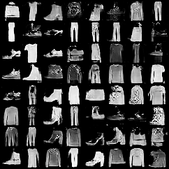
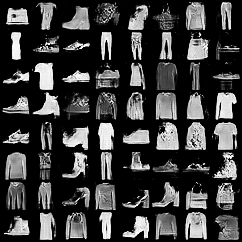

# 🚀 GAN-FashionMNIST Experiments

This project explores different **Generative Adversarial Network (GAN)** architectures and training strategies on the Fashion-MNIST dataset.

We systematically compare:

* 🧠 Architectures: Vanilla GAN, DCGAN
* 📉 Loss Functions: BCE, LSGAN, WGAN
* ⚙️ Optimizers: Adam, RMSprop, SGD

A total of **18 experiments** were conducted and tracked using Weights & Biases (W&B).

---

## 📂 Project Structure

```
gan_experiment/
│
├── models.py           # GAN architectures (Vanilla + DCGAN)
├── losses.py           # BCE, LSGAN, WGAN loss functions
├── dataset.py          # Fashion-MNIST dataloader
├── trainer.py          # Training loop
├── train.py            # Run single experiment
├── run_experiments.py  # Run all 18 experiments
├── evaluate.py         # Generate samples
├── requirements.txt
├── README.md
├── img1.png
└── img2.png
```

---

## ⚙️ Installation

```bash
git clone https://github.com/your-username/GAN-FashionMNIST.git
cd GAN-FashionMNIST

pip install -r requirements.txt
```

---

## 🚀 Usage

### ▶️ Run Single Experiment

```bash
python train.py --arch dcgan --loss wgan --optimizer adam
```

### ▶️ Run All Experiments (18 combinations)

```bash
python run_experiments.py
```

---

## 📊 Experiment Results

| Architecture | Loss  | Optimizer | Best Generator Loss        |
| ------------ | ----- | --------- | -------------------------- |
| Vanilla      | BCE   | Adam      | 1.4521                     |
| Vanilla      | BCE   | RMSprop   | 1.0544                     |
| Vanilla      | BCE   | SGD       | 0.7260                     |
| Vanilla      | LSGAN | Adam      | 0.2446                     |
| Vanilla      | LSGAN | RMSprop   | 0.2056                     |
| Vanilla      | LSGAN | SGD       | 0.3743                     |
| Vanilla      | WGAN  | Adam      | -7.4101                    |
| Vanilla      | WGAN  | RMSprop   | **-10.8363 🔥**            |
| Vanilla      | WGAN  | SGD       | -2.1278                    |
| DCGAN        | BCE   | Adam      | 1.9648                     |
| DCGAN        | BCE   | RMSprop   | 1.5348                     |
| DCGAN        | BCE   | SGD       | 2.2705                     |
| DCGAN        | LSGAN | Adam      | 0.3426                     |
| DCGAN        | LSGAN | RMSprop   | 0.2668                     |
| DCGAN        | LSGAN | SGD       | 0.5201                     |
| DCGAN        | WGAN  | Adam      | 0.0771                     |
| DCGAN        | WGAN  | RMSprop   | 0.0556                     |
| DCGAN        | WGAN  | SGD       | **0.0131 🔥 (Best DCGAN)** |

---

## 📈 Key Insights

* ✅ **WGAN performed best overall** in both architectures
* 🚀 **Vanilla GAN + WGAN + RMSprop** achieved best performance
* 🧠 **DCGAN + WGAN** gave stable and high-quality outputs
* ⚠️ BCE loss showed comparatively weaker performance

---

## 🖼️ Generated Samples

### Sample Output 1



### Sample Output 2



---

## 📊 Experiment Tracking

All experiments were tracked using **Weights & Biases (W&B)**:

* Loss curves
* Training metrics
* Generated images

👉 View Project Dashboard:
https://wandb.ai/manishrai_25afi23-delhi-technological-university/GAN-FashionMNIST

---

## 🧠 Technologies Used

* Python 🐍
* PyTorch 🔥
* Weights & Biases 📊

---

## 📌 Future Work

* Add WGAN-GP (Gradient Penalty)
* Hyperparameter tuning
* Train on higher resolution datasets
* Deploy model using Hugging Face / Streamlit

---

## 🙌 Author

**Manish Rai** <br> Delhi Technological University

---


